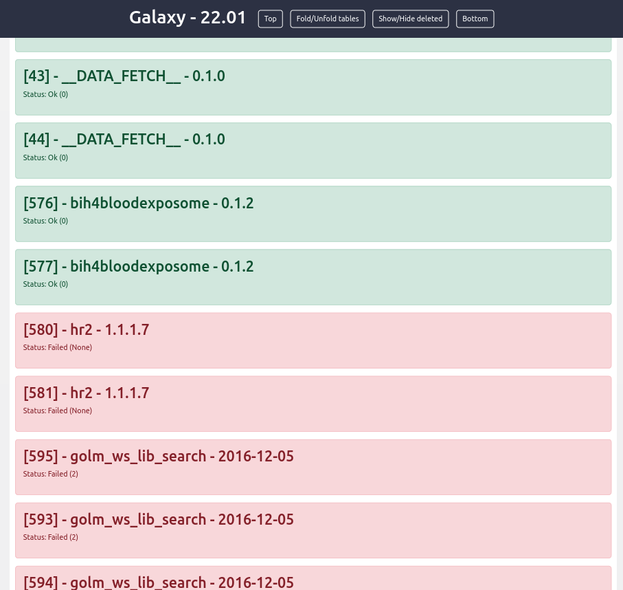

History Metadata Extractor
===

summary
---

This tool xtracts informations from the `jobs_attrs.txt` and
`datasets_attrs` files in exported histories, and produces an html page
showing these informations in a kawaii table.

story
---

You have conscientiously stored your Galaxy history exports through the
years and now need to mine into it. You want to check what has been done
but you fear the time needed to get all the info by reloading your
histories into Galaxy for manual mining. You know there is this
'jobs_attrs.txt' file that contains the golden info, but eh...

So unfriendly!

Worry no more! The History Metadata Extractor is there for you! Just upload
your 'jobs_attrs.txt' file and generate a user-friendly summary of the main
basic info you may be interested in. Tools used, parameters set... The overview
you have been dreaming of in a nice html file! You're welcome :)

How to use this tool
---

Your exported histories are at the zip format.
Extract the history you want to visualize, and upload the following files:

 * jobs_attrs.txt
 * datasets_attrs.txt

Run the History Metadata Extractor tool with these input files. You will get a
HTML file in output. This file can be viewed clicking on the little eye on
the right of the output card in the output panel.


Each history entry is displayed like the following:

```
[{ID}] - {tool name} - {tool version}
status: {text status}({error code})
{table}
```
note that `[ID]` is replaced by `[DELETED]` if the dataset has been deleted.
the error code can be "None" sometimes, if not provided in the archive.

The table is always presented like the following:
```
|              | value | name | extension | hid |
| parameters 1 |       |      |           |     |
| parameters 2 |       |      |           |     |
| parameters 3 |       |      |           |     |
| ...          | ...   | ...  | ...       | ... |
| parameters n |       |      |           |     |
```

The `value` is the textual representation of the parameter provided.
For files, the value is not very interesting but the name, extension and
history ID should be meaningfull to you.
The hid value is the same number as the one found between brackets.
So, if a file with hid = 42 has been input to your tool, you can find where
this file comes from, from its hid.
The only exception is for the `__DATA_FETSH__` tool. This tool is invoked the
when the "upload" button is pressed, so the hid for these files will always be
"_weird_".

examples
===

<div style="width: 760px;">

Produced tables
---

Some tables are produced to display the tool's parameters you used.


Tables can be hidden
---

We can click on the "fold/unforld tables" button to hide/show the tables.
The table of one dataset can be fold/unfold when clicking on the title
of the dataset (for example: `[42] - __DATA_FETCH__ - 0.1.0`)


Displays only non-deleted datasets
---

"show/hide deleted" will hide deleted datasets. Re-click it to re-display
deleted datasets.


</div>

An [example.html](example/example.html) file can be found in the `example`
directory.

Metadata
===

 * **@AUTHOR**: Lain Pavot - lain.pavot@inrae.fr
 * **@CREATION DATE**: 22/06/2022
 * **@LAST UPDATE DATE**: 09/08/2022
 * **@VERSION**: 0.2.0
